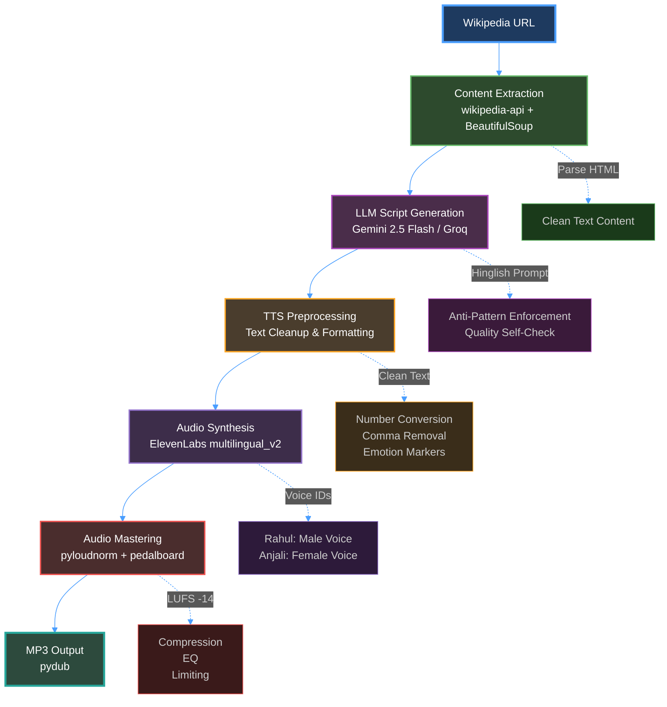

<div align="center">


[](https://youtu.be/l1h2xJkAKgs)
[](https://vani-ai-zeta.vercel.app)
[](https://colab.research.google.com/github/Hazenbox/Vani-ai/blob/main/vani-ai-app/notebooks/vani_ai_pipeline.ipynb)

</div>

---

## Table of Contents

- [At a Glance](#at-a-glance)
- [Try It Out](#try-it-out)
- [What Makes It Special](#what-makes-it-special)
- [Quick Start](#quick-start)
- [How It Works](#how-it-works)
- [Tech Stack](#tech-stack)
- [Prompting Strategy](#prompting-strategy)
- [Documentation](#documentation)
- [Testing](#testing)
- [Project Structure](#project-structure)
- [Development Status](#development-status)

---

<br>

## At a Glance

 **What is Vani AI?**  
>An AI application that turns any Wikipedia article into a 2-minute podcast conversation between **Rahul** (curious host) and **Anjali** (expert host) — speaking naturally in Hinglish with proper emotions, fillers, and reactions.

| Feature | Description |
|---------|-------------|
| **Input** | Any Wikipedia URL or webpage |
| **AI Models** | Google Gemini 2.5 Flash + Groq LLaMA |
| **TTS Engine** | ElevenLabs multilingual_v2 |
| **Output** | ~2 minute natural Hinglish podcast (MP3) |
| **Python Ready** | [Jupyter notebook for Colab execution](https://colab.research.google.com/github/Hazenbox/Vani-ai/blob/main/vani-ai-app/notebooks/vani_ai_pipeline.ipynb) |

<br>
<br>

## Try It Out

### 🎥 Demo Video

<div align="left">

**Watch the full demo showcasing Vani AI in action:**

[](https://youtu.be/l1h2xJkAKgs)

**Demo covers:**
- Project overview and track selection
- Entering a Wikipedia URL
- Script generation with Hinglish output
- Audio synthesis process
- Sample podcast playback
- Technical highlights

</div>

### 🎧 Sample Podcast

<div align="left">

### IPL Ka Jaddu — Cricket Ka Sabse Bada Tamasha — Sample Podcast

<audio controls style="width: 100%; max-width: 600px;">
  <source src="vani-ai-app/Outputs/IPL_Ka_Jaddu_Cricket_Ka_Sabse_Bada_Tamasha.mp3" type="audio/mpeg">
  Your browser does not support the audio element. <a href="vani-ai-app/Outputs/IPL_Ka_Jaddu_Cricket_Ka_Sabse_Bada_Tamasha.mp3">Download the audio file</a>.
</audio>

</div>

**What you'll hear:**
- Natural Hindi-English code-mixing (not literal translations)
- Conversational fillers: "yaar", "na?", "achcha"
- Emotional reactions: "Baap re!", "Wait, seriously?"
- Natural interruptions and laughter
- Professional podcast flow with proper pacing

<br>
<br>

## What Makes It Special

<table style="width: 100%">
<tr>
<td valign="top">

### Two Natural Hosts

**Rahul** — Curious Enthusiast  
Asks engaging questions, shows genuine interest

**Anjali** — Expert Guide  
Provides insights, explains concepts clearly

**Together** — Authentic back-and-forth with interruptions, reactions, and natural chemistry

</td>
<td valign="top">

### True Hinglish

**Not this:** Literal word-by-word translation  
**But this:** Context-aware code-mixing

**Example:**  
*"Yaar Anjali, kal raat randomly kuch padh raha tha... something just blew my mind!"*

Natural language switching that native speakers actually use

</td>
</tr>
<tr>
<td valign="top">

### Smart Generation

1. **Semantic Extraction** — Intelligently parses content
2. **Anti-Pattern Enforcement** — No templated phrases
3. **Quality Verification** — LLM self-checks output
4. **Fact-Dense** — Maintains accuracy without sounding robotic

</td>
<td valign="top">

### Premium Audio

- **ElevenLabs** multilingual_v2 TTS
- **Fixed Podcast Voice Settings** — Consistent voice profiles for professional quality
- **Audio Mastering** — Server-side LUFS normalization and compression
- **Text Preprocessing** — Aggressive cleanup for naturalness
- **Multi-Speaker** — Distinct voices for Rahul & Anjali

</td>
</tr>
</table>

<br>
<br>

---

<br>

## Tech Stack

<table style="width: 100%">
<tr>
<td width="50%">

### Python Pipeline


- Wikipedia content extraction
- Semantic processing for LLM
- Colab-ready notebook pipeline

</td>
<td width="50%">

### Frontend


- Modern UI with Framer Motion animations
- Lightning-fast builds with Vite
- Utility-first styling with Tailwind CSS

</td>
</tr>
<tr>
<td width="50%">

### AI & Generation


- **Gemini 2.5 Flash** — Primary LLM
- **Groq (LLaMA)** — Fallback for rate limits
- **ElevenLabs** — Premium multi-speaker TTS

</td>
<td width="50%">

### Testing


- **Vitest** — Unit & component testing
- **Testing Library** — React testing
- **pytest** — Python validation

</td>
</tr>
</table>

<br>
<br>

---

<br>

## Quick Start

### Prerequisites

| Requirement | Version/Details |
|-------------|-----------------|
| Node.js | 18+ |
| npm | Latest |
| API Keys | Google Gemini + Groq + ElevenLabs |

### Installation

```bash
# 1. Clone and navigate
git clone https://github.com/Hazenbox/Vani-ai.git
cd Vani-ai/vani-ai-app

# 2. Install dependencies
npm install

# 3. Configure environment
echo "VITE_GEMINI_API_KEY=your_gemini_key" > .env
echo "VITE_GROQ_API_KEY=your_groq_key" >> .env
echo "VITE_ELEVENLABS_API_KEY=your_elevenlabs_key" >> .env

# 4. Start development server
npm run dev
```

### Deployment

The web application is deployed on Vercel. See [VERCEL_DEPLOYMENT.md](vani-ai-app/VERCEL_DEPLOYMENT.md) for detailed deployment instructions.

**Live Demo:** [https://vani-ai-zeta.vercel.app](https://vani-ai-zeta.vercel.app)

**Deployment Status:**
- ✅ Live on Vercel: [vani-ai-zeta.vercel.app](https://vani-ai-zeta.vercel.app)
- ✅ Deployment configuration ready (`vercel.json`)
- ✅ Serverless function configured (`api/master-audio.ts`)

**Note:** The application requires API keys (Gemini, Groq, ElevenLabs) to be configured in Vercel's environment variables for production use.

### Usage Flow (Python Pipeline)


| Step | Action | Time |
|:----:|--------|:----:|
| 1 | Paste Wikipedia URL | 5 sec |
| 2 | AI generates Hinglish script | 30-60 sec |
| 3 | Edit script (optional) | Variable |
| 4 | Synthesize with TTS | 20-40 sec |
| 5 | Download MP3 | Instant |

<br>

<br>

---

<br>

## How It Works

### Python Pipeline Architecture



### Key Components (Python Pipeline)

| Component | Purpose | Technology |
|-----------|---------|------------|
| **vani_ai_pipeline.ipynb** | Complete end-to-end pipeline | [Jupyter Notebook + Colab](https://colab.research.google.com/github/Hazenbox/Vani-ai/blob/main/vani-ai-app/notebooks/vani_ai_pipeline.ipynb) |
| **Wikipedia Extraction** | Content parsing and cleaning | wikipedia-api + BeautifulSoup |
| **Script Generation** | Hinglish dialogue creation | Gemini 2.5 Flash / Groq LLaMA |
| **TTS Synthesis** | Multi-speaker audio generation | ElevenLabs multilingual_v2 |
| **Audio Mastering** | Professional audio processing | pyloudnorm + pedalboard |
| **docs/guidelines/** | Prompting strategies | Markdown docs |

<br>
<br>

---

<br>

## Prompting Strategy

Our approach to generating authentic Hinglish dialogue focuses on **four pillars:**

**1. Anti-pattern enforcement**  
We explicitly ban templated phrases ("Arey Rahul, tune dekha?") and repetitive reactions ("Haan yaar, bilkul"), forcing unique openings for each topic.

**2. Content-driven variety**  
The opener is chosen based on content type: surprising facts lead with hooks, technical topics start with questions, biographies begin with anecdotes.

**3. Sparing naturalism**  
Fillers ('yaar', 'na?') are limited to 2-3 per script maximum. Many lines have zero fillers, mimicking how professionals actually speak.

**4. Quality self-verification**  
The LLM checks its output against a checklist: unique opening, varied reactions, actual article facts, and balanced speaker contributions.

The two-host format (curious Rahul + expert Anjali) creates natural back-and-forth that sounds genuinely conversational, not templated.

**Full details:** [Prompting Strategy Documentation](vani-ai-app/docs/guidelines/PROMPTING_STRATEGY.md)

### Conversational Elements

| Element | Examples | Implementation |
|---------|----------|----------------|
| **Fillers** | "yaar", "na?", "umm", "achcha" | Sparing use (2-3 per script) |
| **Interruptions** | Natural overlaps | Dynamic script generation |
| **Laughter** | "(laughs)", "haha", "hehe" | Emotional markers |
| **Reactions** | "Baap re!", "Wait, seriously?" | Context-aware responses |
| **Code-Mixing** | "Kal raat randomly..." | Authentic switching patterns |

<br>

<br>

---

<br>

## Documentation

> Comprehensive documentation organized in `vani-ai-app/docs/`

<table style="width: 100%">
<tr>
<td valign="top">

### Guidelines
**Prompting & Script Writing**

- [Prompting Strategy](vani-ai-app/docs/guidelines/PROMPTING_STRATEGY.md)  
  *LLM techniques for authentic Hinglish*

- [Script Guidelines v2](vani-ai-app/docs/guidelines/conversational_audio_script_guidelines_v2.md)  
  *TTS-optimized writing rules*

- [Project Positioning](vani-ai-app/docs/guidelines/PROJECT_POSITIONING.md)  
  *Vision and goals*

</td>
<td valign="top">

### Training Examples
**9+ Reference Podcasts**

- [Example Scripts](vani-ai-app/docs/training/examples/)

**Topics Covered:**
- Artificial Intelligence
- Cricket (IPL Teams)
- Bollywood Personalities
- Politics & Current Events
- Technology Trends

</td>
</tr>
<tr>
<td valign="top">

### Implementation Docs

- [Technical Design](vani-ai-app/docs/implementation/TECHNICAL_DESIGN.md)  
  *System architecture overview*

- [TTS Improvements](vani-ai-app/docs/implementation/TTS_IMPROVEMENTS_SUMMARY.md)  
  *Audio optimization strategies*

- [Dynamic Voice Settings](vani-ai-app/docs/implementation/DYNAMIC_VOICE_UPGRADE.md)  
  *Voice parameter tuning (historical reference)*

</td>
<td valign="top">

### Testing Guides

- [Colab Testing Guide](vani-ai-app/docs/testing/COLAB_TESTING_GUIDE.md)  
  *Python pipeline testing*

- [TTS Cleanup Tests](vani-ai-app/docs/testing/TTS_CLEANUP_TEST.md)  
  *Audio quality validation*

</td>
</tr>
</table>

<br>
<br>

---

<br>

## Testing

### Quick Test Commands

```bash
# Navigate to app folder
cd vani-ai-app

# Run TypeScript tests
npm test

# Coverage report
npm run test:coverage

# Python tests (requires pytest)
cd tests/python
pip install -r requirements.txt
pytest -v
```

### Test Suite Coverage

| Area | Framework | Status | Coverage |
|------|-----------|--------|----------|
| **Script Generation** | Vitest | ✅ Passing | Unit tests for LLM prompting |
| **TTS Preprocessing** | Vitest | ⚠️ Partial | Text cleanup validation (6 tests need updates) |
| **UI Components** | Testing Library | ✅ Passing | Component behavior |
| **Wikipedia Extraction** | pytest | ✅ Ready | Content parsing (comprehensive) |
| **Audio Synthesis** | pytest | ✅ Ready | TTS integration (comprehensive) |
| **End-to-End** | Manual | ✅ Complete | Full pipeline verification |

### Test Status Summary

- ✅ **TypeScript Tests:** 2/3 test suites fully passing (45 tests total)
  - `utils.test.ts`: ✅ All 17 tests passing
  - `useKeyboardShortcuts.test.ts`: ✅ All 28 tests passing
  - `podcastService.test.ts`: ⚠️ 32/38 tests passing (6 tests need assertion updates due to TTS improvements)

- ✅ **Python Tests:** Comprehensive test suites ready
  - `test_wikipedia_extraction.py`: 20+ tests covering URL parsing, content cleaning, validation
  - `test_tts_synthesis.py`: 15+ tests covering voice config, preprocessing, timing

**Note:** The 6 failing tests in `podcastService.test.ts` are due to behavior changes in TTS preprocessing (improved text cleaning). These are assertion mismatches, not functional bugs. Tests can be updated to match current implementation.

<br>

<br>

---

<br>

## Project Structure

<details>
<summary><strong>Click to expand: Full directory tree</strong></summary>

```
vani-ai-app/
├── src/                              React Application
│   ├── components/                   UI Components
│   │   ├── ScriptEditor.tsx          Interactive script editing
│   │   ├── UrlInput.tsx              URL input interface
│   │   └── Visualizer.tsx            Audio visualization
│   │
│   ├── services/                     Core Business Logic
│   │   ├── podcastService.ts         Script generation & TTS
│   │   └── db.ts                     IndexedDB storage
│   │
│   ├── hooks/                        Custom React Hooks
│   └── lib/                          Utilities
│
├── docs/                             Documentation
│   ├── guidelines/                   Prompting strategies
│   ├── training/                     Example scripts (9+)
│   ├── implementation/               Technical design
│   └── testing/                      Test guides
│
├── notebooks/                        Python Pipeline
│   └── vani_ai_pipeline.ipynb        Colab-ready notebook
│
├── tests/                            Test Suites
│   ├── services/                     Service unit tests
│   ├── hooks/                        Hook tests
│   └── python/                       Python validation
│
├── Outputs/                          Generated Podcasts
│   └── IPL_Ka_Jaddu_Cricket_Ka_Sabse_Bada_Tamasha.mp3   Sample output
│
├── scripts/                          Utility Scripts
├── api/                               Serverless Functions
│   └── master-audio.ts               Audio mastering API
└── dist/                             Production Build
```

</details>

### Key Files

| File | Purpose | Importance |
|------|---------|:----------:|
| `src/services/podcastService.ts` | Core script generation + TTS logic | High |
| `notebooks/vani_ai_pipeline.ipynb` | [Python/Colab end-to-end pipeline](https://colab.research.google.com/github/Hazenbox/Vani-ai/blob/main/vani-ai-app/notebooks/vani_ai_pipeline.ipynb) | High |
| `docs/guidelines/PROMPTING_STRATEGY.md` | Hinglish prompting techniques | Medium |
| `Outputs/IPL_Ka_Jaddu_Cricket_Ka_Sabse_Bada_Tamasha.mp3` | Sample podcast output | Medium |

<br>

<br>

---

<br>

## Development Status

### Completed Features

| Feature | Status | Notes |
|---------|:------:|-------|
| Web UI | ✓ Complete | Fully functional with animations |
| Script Generation | ✓ Complete | Gemini + Groq multi-LLM |
| Multi-Speaker TTS | ✓ Complete | ElevenLabs integration |
| Python Pipeline | ✓ Complete | Jupyter notebook ready |
| Documentation | ✓ Complete | Comprehensive guides |
| Sample Output | ✓ Complete | Delhi Capitals podcast |

### Known Limitations

- **API Keys Required** — Gemini + Groq + ElevenLabs (free tiers available)
- **Bundle Size** — 1.2MB (code splitting needed)
- **Rate Limits** — ElevenLabs TTS has rate limits
- **Tests** — 6 tests need updates (behavior changes from TTS improvements)

<br>
<br>

---

<br>

## Assumptions & Design Decisions

1. **Two-speaker format**: Natural conversations require dialogue between two participants (Rahul as curious enthusiast, Anjali as expert guide) to create authentic back-and-forth dynamics.

2. **Equal-energy friendship dynamic**: Both speakers are friends having a conversation, not an expert teaching a student, to prevent one-sided lecture mode.

3. **Fact-first approach**: Every turn must contain at least one concrete fact (name, date, number, event) to maintain information density in 2-minute podcasts.

4. **Hinglish code-mixing**: Reflects how urban Indian speakers actually communicate, requiring sophisticated prompting to avoid literal translations.

5. **Anti-pattern enforcement**: LLMs tend to repeat templated phrases, so explicit bans on common patterns ("Arey Rahul, tune dekha?") prevent robotic dialogue.

6. **Sparing naturalism**: Professional speakers don't overuse fillers; limit "yaar", "na?" to 2-3 per script maximum to maintain professional quality.

7. **TTS-first design**: Text-to-speech engines have specific formatting requirements, so TTS rules are placed FIRST in prompts to prevent audio artifacts.

8. **Content-driven variety**: Different content types require different conversation styles (surprising facts need hooks, technical topics need questions, biographies need anecdotes).

9. **Wikipedia as primary source**: Content extraction is optimized for Wikipedia's consistent structure, assuming reliable article format.

10. **Quality self-verification**: LLMs can validate their own output against a checklist (unique opening, varied reactions, factual content) before final submission.

---

<br>

## License & Credits

<div align="left">

**Created for Winter 30 Hackathon 2026**

### Acknowledgments

- [Google Gemini](https://ai.google.dev/) —  LLM for script generation
- [ElevenLabs](https://elevenlabs.io/) — Used for multi-speaker TTS

Special thanks to the community for feedback on Hinglish naturalness improvements

<br>
<br>

## Get in Touch

[](https://github.com/Hazenbox/Vani-ai)
[](https://github.com/Hazenbox/Vani-ai/issues)

</div>


