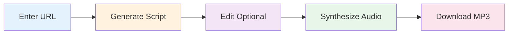
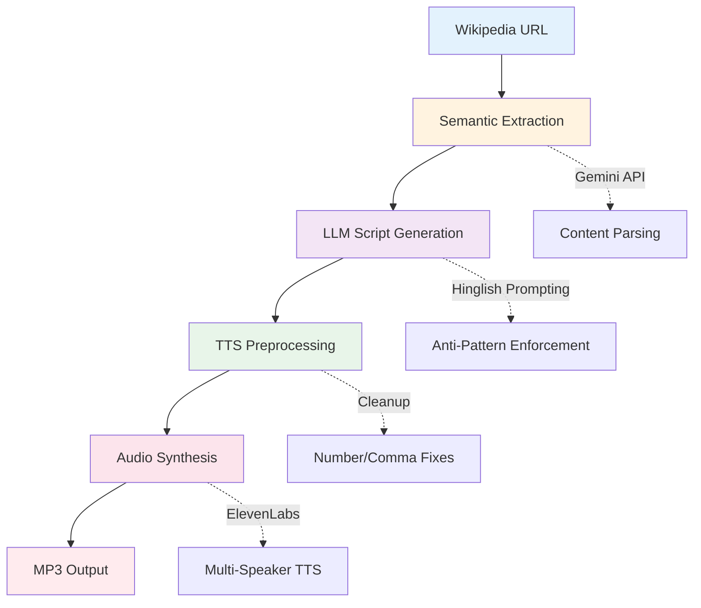

<div align="center">

# Vani AI

**Upendranath Kaki (Upen), Product Designer, SOI**

### Transform Wikipedia articles into natural Hinglish podcasts

<sub>AI-powered two-speaker conversations with authentic Hindi-English code-mixing</sub>

[](vani-ai-app/Outputs/Delhi_Capitals_Ka_Safar.mp3)
[](vani-ai-app/notebooks/vani_ai_pipeline.ipynb)

</div>

---

## Table of Contents

- [At a Glance](#at-a-glance)
- [Try It Out](#try-it-out)
- [What Makes It Special](#what-makes-it-special)
- [Quick Start](#quick-start)
- [How It Works](#how-it-works)
- [Tech Stack](#tech-stack)
- [Prompting Strategy](#prompting-strategy)
- [Documentation](#documentation)
- [Testing](#testing)
- [Project Structure](#project-structure)
- [Development Status](#development-status)

---

<br>

## At a Glance

> **What is Vani AI?**  
> An AI application that turns any Wikipedia article into a 2-minute podcast conversation between **Rahul** (curious host) and **Anjali** (expert host) — speaking naturally in Hinglish with proper emotions, fillers, and reactions.

<table width="100%">
<tr>
<td><strong>Feature</strong></td>
<td><strong>Description</strong></td>
</tr>
<tr>
<td><strong>Input</strong></td>
<td>Any Wikipedia URL or webpage</td>
</tr>
<tr>
<td><strong>AI Models</strong></td>
<td>Google Gemini 2.5 Flash + Groq LLaMA</td>
</tr>
<tr>
<td><strong>TTS Engine</strong></td>
<td>ElevenLabs multilingual_v2</td>
</tr>
<tr>
<td><strong>Output</strong></td>
<td>~2 minute natural Hinglish podcast (MP3)</td>
</tr>
<tr>
<td><strong>Python Ready</strong></td>
<td>Jupyter notebook for Colab execution</td>
</tr>
</table>

<br>
<br>

## Try It Out

<div align="center">

### Delhi Capitals Ka Safar — Sample Podcast

<audio controls style="width: 100%; max-width: 600px;">
  <source src="vani-ai-app/Outputs/Delhi_Capitals_Ka_Safar.mp3" type="audio/mpeg">
  Your browser does not support the audio element. <a href="vani-ai-app/Outputs/Delhi_Capitals_Ka_Safar.mp3">Download the audio file</a>.
</audio>

</div>

**What you'll hear:**
- Natural Hindi-English code-mixing (not literal translations)
- Conversational fillers: "yaar", "na?", "achcha"
- Emotional reactions: "Baap re!", "Wait, seriously?"
- Natural interruptions and laughter
- Professional podcast flow with proper pacing

<br>
<br>

## What Makes It Special

<table width="100%">
<tr>
<td width="50%" valign="top">

### Two Natural Hosts

**Rahul** — Curious Enthusiast  
Asks engaging questions, shows genuine interest

**Anjali** — Expert Guide  
Provides insights, explains concepts clearly

**Together** — Authentic back-and-forth with interruptions, reactions, and natural chemistry

</td>
<td width="50%" valign="top">

### True Hinglish

**Not this:** Literal word-by-word translation  
**But this:** Context-aware code-mixing

**Example:**  
*"Yaar Anjali, kal raat randomly kuch padh raha tha... something just blew my mind!"*

Natural language switching that native speakers actually use

</td>
</tr>
<tr>
<td width="50%" valign="top">

### Smart Generation

1. **Semantic Extraction** — Intelligently parses content
2. **Anti-Pattern Enforcement** — No templated phrases
3. **Quality Verification** — LLM self-checks output
4. **Fact-Dense** — Maintains accuracy without sounding robotic

</td>
<td width="50%" valign="top">

### Premium Audio

- **ElevenLabs** multilingual_v2 TTS
- **Dynamic Voice Settings** — Emotion-aware parameters
- **Text Preprocessing** — Aggressive cleanup for naturalness
- **Multi-Speaker** — Distinct voices for Rahul & Anjali

</td>
</tr>
</table>

<br>
<br>

---

<br>

## Tech Stack

<table width="100%">
<tr>
<td width="50%">

### Python Pipeline


- Wikipedia content extraction
- Semantic processing for LLM
- Colab-ready notebook pipeline

</td>
<td width="50%">

### Frontend


- Modern UI with Framer Motion animations
- Lightning-fast builds with Vite
- Utility-first styling with Tailwind CSS

</td>
</tr>
<tr>
<td width="50%">

### AI & Generation


- **Gemini 2.5 Flash** — Primary LLM
- **Groq (LLaMA)** — Fallback for rate limits
- **ElevenLabs** — Premium multi-speaker TTS

</td>
<td width="50%">

### Testing


- **Vitest** — Unit & component testing
- **Testing Library** — React testing
- **pytest** — Python validation

</td>
</tr>
</table>

<br>
<br>

---

<br>

## Quick Start

### Prerequisites

<table width="100%">
<tr>
<td><strong>Requirement</strong></td>
<td><strong>Version/Details</strong></td>
</tr>
<tr>
<td>Node.js</td>
<td>18+</td>
</tr>
<tr>
<td>npm</td>
<td>Latest</td>
</tr>
<tr>
<td>API Keys</td>
<td>Google Gemini + ElevenLabs</td>
</tr>
</table>

### Installation

```bash
# 1. Clone and navigate
git clone https://github.com/Hazenbox/Vani-ai.git
cd Vani-ai/vani-ai-app

# 2. Install dependencies
npm install

# 3. Configure environment
echo "VITE_GEMINI_API_KEY=your_gemini_key" > .env
echo "VITE_ELEVENLABS_API_KEY=your_elevenlabs_key" >> .env

# 4. Start development server
npm run dev
```

### Usage Flow



<table width="100%">
<tr>
<td><strong>Step</strong></td>
<td><strong>Action</strong></td>
<td><strong>Time</strong></td>
</tr>
<tr>
<td>1</td>
<td>Paste Wikipedia URL</td>
<td>5 sec</td>
</tr>
<tr>
<td>2</td>
<td>AI generates Hinglish script</td>
<td>30-60 sec</td>
</tr>
<tr>
<td>3</td>
<td>Edit script (optional)</td>
<td>Variable</td>
</tr>
<tr>
<td>4</td>
<td>Synthesize with TTS</td>
<td>20-40 sec</td>
</tr>
<tr>
<td>5</td>
<td>Download MP3</td>
<td>Instant</td>
</tr>
</table>

<br>
<br>

---

<br>

## How It Works

### Pipeline Architecture



### Key Components

<table width="100%">
<tr>
<td><strong>Component</strong></td>
<td><strong>Purpose</strong></td>
<td><strong>Technology</strong></td>
</tr>
<tr>
<td><strong>podcastService.ts</strong></td>
<td>Core script generation & TTS</td>
<td>TypeScript + Gemini</td>
</tr>
<tr>
<td><strong>semanticExtraction.ts</strong></td>
<td>URL content extraction</td>
<td>Gemini API</td>
</tr>
<tr>
<td><strong>ScriptEditor.tsx</strong></td>
<td>Interactive editing UI</td>
<td>React + Framer Motion</td>
</tr>
<tr>
<td><strong>vani_ai_pipeline.ipynb</strong></td>
<td>Python/Colab pipeline</td>
<td>Jupyter Notebook</td>
</tr>
<tr>
<td><strong>docs/guidelines/</strong></td>
<td>Prompting strategies</td>
<td>Markdown docs</td>
</tr>
</table>

<br>
<br>

---

<br>

## Prompting Strategy

Our approach to generating authentic Hinglish dialogue focuses on **four pillars:**

**1. Anti-pattern enforcement**  
We explicitly ban templated phrases ("Arey Rahul, tune dekha?") and repetitive reactions ("Haan yaar, bilkul"), forcing unique openings for each topic.

**2. Content-driven variety**  
The opener is chosen based on content type: surprising facts lead with hooks, technical topics start with questions, biographies begin with anecdotes.

**3. Sparing naturalism**  
Fillers ('yaar', 'na?') are limited to 2-3 per script maximum. Many lines have zero fillers, mimicking how professionals actually speak.

**4. Quality self-verification**  
The LLM checks its output against a checklist: unique opening, varied reactions, actual article facts, and balanced speaker contributions.

The two-host format (curious Rahul + expert Anjali) creates natural back-and-forth that sounds genuinely conversational, not templated.

**Full details:** [Prompting Strategy Documentation](vani-ai-app/docs/guidelines/PROMPTING_STRATEGY.md)

### Conversational Elements

<table width="100%">
<tr>
<td><strong>Element</strong></td>
<td><strong>Examples</strong></td>
<td><strong>Implementation</strong></td>
</tr>
<tr>
<td><strong>Fillers</strong></td>
<td>"yaar", "na?", "umm", "achcha"</td>
<td>Sparing use (2-3 per script)</td>
</tr>
<tr>
<td><strong>Interruptions</strong></td>
<td>Natural overlaps</td>
<td>Dynamic script generation</td>
</tr>
<tr>
<td><strong>Laughter</strong></td>
<td>"(laughs)", "haha", "hehe"</td>
<td>Emotional markers</td>
</tr>
<tr>
<td><strong>Reactions</strong></td>
<td>"Baap re!", "Wait, seriously?"</td>
<td>Context-aware responses</td>
</tr>
<tr>
<td><strong>Code-Mixing</strong></td>
<td>"Kal raat randomly..."</td>
<td>Authentic switching patterns</td>
</tr>
</table>

<br>
<br>

---

<br>

## Documentation

> Comprehensive documentation organized in `vani-ai-app/docs/`

<table width="100%">
<tr>
<td width="50%" valign="top">

### Guidelines
**Prompting & Script Writing**

- [Prompting Strategy](vani-ai-app/docs/guidelines/PROMPTING_STRATEGY.md)  
  *LLM techniques for authentic Hinglish*

- [Script Guidelines v2](vani-ai-app/docs/guidelines/conversational_audio_script_guidelines_v2.md)  
  *TTS-optimized writing rules*

- [Project Positioning](vani-ai-app/docs/guidelines/PROJECT_POSITIONING.md)  
  *Vision and goals*

</td>
<td width="50%" valign="top">

### Training Examples
**9+ Reference Podcasts**

- [Example Scripts](vani-ai-app/docs/training/examples/)

**Topics Covered:**
- Artificial Intelligence
- Cricket (IPL Teams)
- Bollywood Personalities
- Politics & Current Events
- Technology Trends

</td>
</tr>
<tr>
<td width="50%" valign="top">

### Implementation Docs

- [Technical Design](vani-ai-app/docs/implementation/TECHNICAL_DESIGN.md)  
  *System architecture overview*

- [TTS Improvements](vani-ai-app/docs/implementation/TTS_IMPROVEMENTS_SUMMARY.md)  
  *Audio optimization strategies*

- [Dynamic Voice Settings](vani-ai-app/docs/implementation/DYNAMIC_VOICE_UPGRADE.md)  
  *Voice parameter tuning*

</td>
<td width="50%" valign="top">

### Testing Guides

- [Colab Testing Guide](vani-ai-app/docs/testing/COLAB_TESTING_GUIDE.md)  
  *Python pipeline testing*

- [TTS Cleanup Tests](vani-ai-app/docs/testing/TTS_CLEANUP_TEST.md)  
  *Audio quality validation*

</td>
</tr>
</table>

<br>
<br>

---

<br>

## Testing

### Quick Test Commands

```bash
# Navigate to app folder
cd vani-ai-app

# Run all tests
npm test

# Coverage report
npm run test:coverage

# Python tests
cd tests/python && pytest
```

### Test Suite Coverage

<table width="100%">
<tr>
<td><strong>Area</strong></td>
<td><strong>Framework</strong></td>
<td><strong>Coverage</strong></td>
</tr>
<tr>
<td><strong>Script Generation</strong></td>
<td>Vitest</td>
<td>Unit tests for LLM prompting</td>
</tr>
<tr>
<td><strong>TTS Preprocessing</strong></td>
<td>Vitest</td>
<td>Text cleanup validation</td>
</tr>
<tr>
<td><strong>UI Components</strong></td>
<td>Testing Library</td>
<td>Component behavior</td>
</tr>
<tr>
<td><strong>Wikipedia Extraction</strong></td>
<td>pytest</td>
<td>Content parsing</td>
</tr>
<tr>
<td><strong>Audio Synthesis</strong></td>
<td>pytest</td>
<td>TTS integration</td>
</tr>
<tr>
<td><strong>End-to-End</strong></td>
<td>Manual</td>
<td>Full pipeline verification</td>
</tr>
</table>

<br>
<br>

---

<br>

## Project Structure

<details>
<summary><strong>Click to expand: Full directory tree</strong></summary>

```
vani-ai-app/
├── src/                              React Application
│   ├── components/                   UI Components
│   │   ├── ScriptEditor.tsx          Interactive script editing
│   │   ├── UrlInput.tsx              URL input interface
│   │   └── Visualizer.tsx            Audio visualization
│   │
│   ├── services/                     Core Business Logic
│   │   ├── podcastService.ts         Script generation & TTS
│   │   ├── semanticExtraction.ts     URL content extraction
│   │   └── comparisonService.ts      Audio comparison
│   │
│   ├── hooks/                        Custom React Hooks
│   └── lib/                          Utilities
│
├── docs/                             Documentation
│   ├── guidelines/                   Prompting strategies
│   ├── training/                     Example scripts (9+)
│   ├── implementation/               Technical design
│   └── testing/                      Test guides
│
├── notebooks/                        Python Pipeline
│   └── vani_ai_pipeline.ipynb        Colab-ready notebook
│
├── tests/                            Test Suites
│   ├── services/                     Service unit tests
│   ├── hooks/                        Hook tests
│   └── python/                       Python validation
│
├── Outputs/                          Generated Podcasts
│   └── Delhi_Capitals_Ka_Safar.mp3   Sample output
│
├── scripts/                          Utility Scripts
└── dist/                             Production Build
```

</details>

### Key Files

<table width="100%">
<tr>
<td><strong>File</strong></td>
<td><strong>Purpose</strong></td>
<td><strong>Importance</strong></td>
</tr>
<tr>
<td><code>src/services/podcastService.ts</code></td>
<td>Core script generation + TTS logic</td>
<td>High</td>
</tr>
<tr>
<td><code>notebooks/vani_ai_pipeline.ipynb</code></td>
<td>Python/Colab end-to-end pipeline</td>
<td>High</td>
</tr>
<tr>
<td><code>docs/guidelines/PROMPTING_STRATEGY.md</code></td>
<td>Hinglish prompting techniques</td>
<td>Medium</td>
</tr>
<tr>
<td><code>Outputs/Delhi_Capitals_Ka_Safar.mp3</code></td>
<td>Sample podcast output</td>
<td>Medium</td>
</tr>
</table>

<br>
<br>

---

<br>

## Development Status

### Completed Features

<table width="100%">
<tr>
<td><strong>Feature</strong></td>
<td><strong>Status</strong></td>
<td><strong>Notes</strong></td>
</tr>
<tr>
<td>Web UI</td>
<td>Complete</td>
<td>Fully functional with animations</td>
</tr>
<tr>
<td>Script Generation</td>
<td>Complete</td>
<td>Gemini + Groq multi-LLM</td>
</tr>
<tr>
<td>Multi-Speaker TTS</td>
<td>Complete</td>
<td>ElevenLabs integration</td>
</tr>
<tr>
<td>Python Pipeline</td>
<td>Complete</td>
<td>Jupyter notebook ready</td>
</tr>
<tr>
<td>Documentation</td>
<td>Complete</td>
<td>Comprehensive guides</td>
</tr>
<tr>
<td>Sample Output</td>
<td>Complete</td>
<td>Delhi Capitals podcast</td>
</tr>
</table>

### Known Limitations

- **API Keys Required** — Gemini + ElevenLabs (free tiers available)
- **Bundle Size** — 1.2MB (code splitting needed)
- **Rate Limits** — ElevenLabs TTS has rate limits
- **Tests** — 6 tests need updates (behavior changes from TTS improvements)

<br>
<br>

---

<br>

## License & Credits

<div align="center">

**Created for Winter 30 Hackathon 2026**

### Acknowledgments

[Google Gemini](https://ai.google.dev/) • [ElevenLabs](https://elevenlabs.io/)

Special thanks to the community for feedback on Hinglish naturalness improvements

<br>
<br>

## Get in Touch

[](https://github.com/Hazenbox/Vani-ai)
[](https://github.com/Hazenbox/Vani-ai/issues)

<br>

<sub>Made with care for authentic Hinglish conversations</sub>

</div>
