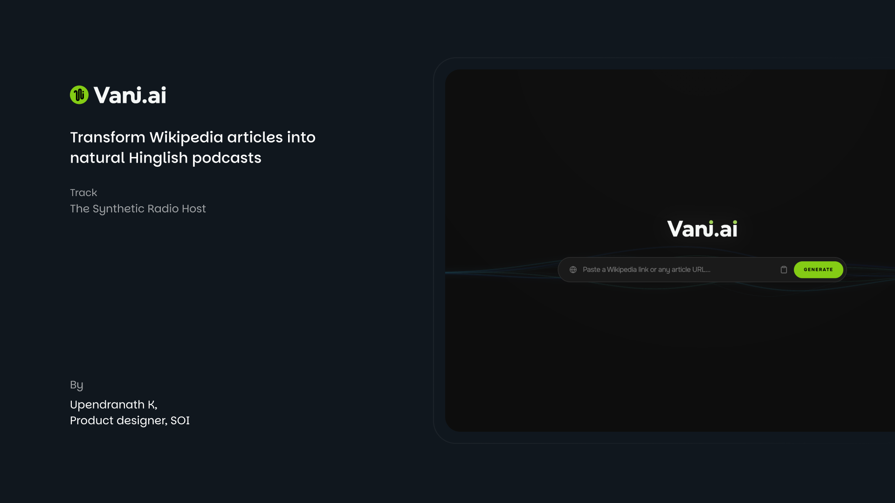
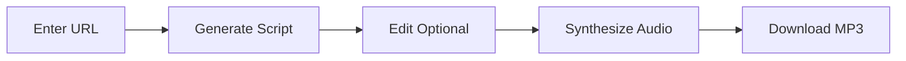
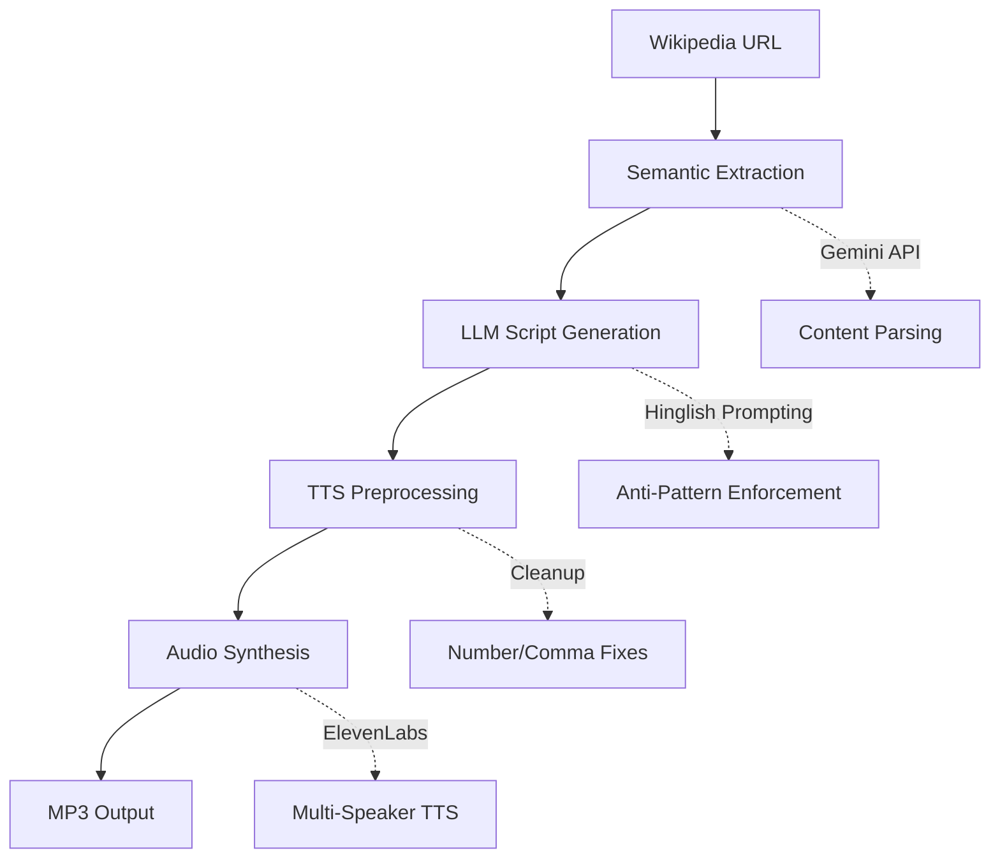

<div align="center">



[](vani-ai-app/Outputs/Delhi_Capitals_Ka_Safar.mp3)
[](vani-ai-app/notebooks/vani_ai_pipeline.ipynb)

</div>

## 📑 Table of Contents

- [At a Glance](#-at-a-glance)
- [Audio Sample](#-audio-sample)
- [Features](#-features)
- [Python Pipeline](#-python-pipeline)
- [Quick Start](#-quick-start)
- [How It Works](#-how-it-works)
- [Tech Stack](#-tech-stack)
- [Prompting Strategy](#-prompting-strategy)
- [Documentation](#-documentation)
- [Testing](#-testing)
- [Project Structure](#-project-structure)
- [Development Status](#-development-status)

<br>

## 👀 At a Glance

An AI application that turns any Wikipedia article into a 2-minute podcast conversation between **Rahul** (curious host) and **Anjali** (expert host) — speaking naturally in Hinglish with proper emotions, fillers, and reactions.

| Feature | Description |
|---------|-------------|
| **Input** | Any Wikipedia URL or webpage |
| **AI Models** | Google Gemini 2.5 Flash + Groq LLaMA |
| **TTS Engine** | ElevenLabs multilingual_v2 |
| **Output** | ~2 minute natural Hinglish podcast (MP3) |
| **Python Ready** | Jupyter notebook for Colab execution |

<br>
<br>

## 🎧 Audio Sample

### Delhi Capitals Ka Safar — Sample Podcast

https://github.com/user-attachments/assets/delhi-capitals-sample.mp4

[](vani-ai-app/Outputs/Delhi_Capitals_Ka_Safar.mp3)

**What you'll hear:**
- Natural Hindi-English code-mixing (not literal translations)
- Conversational fillers: "yaar", "na?", "achcha"
- Emotional reactions: "Baap re!", "Wait, seriously?"
- Natural interruptions and laughter
- Professional podcast flow with proper pacing

<br>
<br>

## ✨ Features

<table style="width: 100%">
<tr>
<td valign="top">

### Two Natural Hosts

**Rahul** — Curious Enthusiast  
Asks engaging questions, shows genuine interest

**Anjali** — Expert Guide  
Provides insights, explains concepts clearly

**Together** — Authentic back-and-forth with interruptions, reactions, and natural chemistry

</td>
<td valign="top">

### True Hinglish

**Not this:** Literal word-by-word translation  
**But this:** Context-aware code-mixing

**Example:**  
*"Yaar Anjali, kal raat randomly kuch padh raha tha... something just blew my mind!"*

Natural language switching that native speakers actually use

</td>
</tr>
<tr>
<td valign="top">

### Smart Generation

1. **Semantic Extraction** — Intelligently parses content
2. **Anti-Pattern Enforcement** — No templated phrases
3. **Quality Verification** — LLM self-checks output
4. **Fact-Dense** — Maintains accuracy without sounding robotic

</td>
<td valign="top">

### Premium Audio

- **ElevenLabs** multilingual_v2 TTS
- **Dynamic Voice Settings** — Emotion-aware parameters
- **Text Preprocessing** — Aggressive cleanup for naturalness
- **Multi-Speaker** — Distinct voices for Rahul & Anjali

</td>
</tr>
</table>

<br>
<br>

## 🐍 Python Pipeline

This is a **Python-first hackathon project**. The Python pipeline is the core orchestrator that powers the entire system.

### Why Python?

| Role | How Python Helps |
|------|------------------|
| **Content Extraction** | Fetches and cleans Wikipedia articles using requests + BeautifulSoup |
| **LLM Orchestration** | Manages Gemini API calls for Hinglish script generation |
| **TTS Integration** | Coordinates ElevenLabs API for multi-speaker audio synthesis |
| **Colab Ready** | Jupyter notebook runs end-to-end in Google Colab |
| **Validation** | pytest ensures pipeline reliability |

### Python Notebook

The complete pipeline is available as a Jupyter notebook:

```bash
# Run in Google Colab or locally
notebooks/vani_ai_pipeline.ipynb
```

[](vani-ai-app/notebooks/vani_ai_pipeline.ipynb)

<br>
<br>

## 🛠️ Tech Stack

<table style="width: 100%">
<tr>
<td width="50%">

### Python Pipeline


- Wikipedia content extraction
- Semantic processing for LLM
- Colab-ready notebook pipeline

</td>
<td width="50%">

### Frontend


- Modern UI with Framer Motion animations
- Lightning-fast builds with Vite
- Utility-first styling with Tailwind CSS

</td>
</tr>
<tr>
<td width="50%">

### AI & Generation


- **Gemini 2.5 Flash** — Primary LLM
- **Groq (LLaMA)** — Fallback for rate limits
- **ElevenLabs** — Premium multi-speaker TTS

</td>
<td width="50%">

### Testing


- **Vitest** — Unit & component testing
- **Testing Library** — React testing
- **pytest** — Python validation

</td>
</tr>
</table>

<br>
<br>

## 🚀 Quick Start

### Prerequisites

| Requirement | Version/Details |
|-------------|-----------------|
| Node.js | 18+ |
| npm | Latest |
| API Keys | Google Gemini + ElevenLabs |

### Installation

```bash
# 1. Clone and navigate
git clone https://github.com/Hazenbox/Vani-ai.git
cd Vani-ai/vani-ai-app

# 2. Install dependencies
npm install

# 3. Configure environment
echo "VITE_GEMINI_API_KEY=your_gemini_key" > .env
echo "VITE_ELEVENLABS_API_KEY=your_elevenlabs_key" >> .env

# 4. Start development server
npm run dev
```

### Usage Flow



| Step | Action | Time |
|:----:|--------|:----:|
| 1 | Paste Wikipedia URL | 5 sec |
| 2 | AI generates Hinglish script | 30-60 sec |
| 3 | Edit script (optional) | Variable |
| 4 | Synthesize with TTS | 20-40 sec |
| 5 | Download MP3 | Instant |

<br>
<br>

## ⚙️ How It Works

### Pipeline Architecture



### Key Components

| Component | Purpose | Technology |
|-----------|---------|------------|
| **🐍 vani_ai_pipeline.ipynb** | **Python end-to-end pipeline** | **Jupyter + Colab** |
| **🐍 tests/python/** | **Python validation tests** | **pytest** |
| podcastService.ts | Core script generation & TTS | TypeScript + Gemini |
| semanticExtraction.ts | URL content extraction | Gemini API |
| ScriptEditor.tsx | Interactive editing UI | React + Framer Motion |

<br>
<br>

## 💬 Prompting Strategy

Our approach to generating authentic Hinglish dialogue focuses on **four pillars:**

**1. Anti-pattern enforcement**  
We explicitly ban templated phrases ("Arey Rahul, tune dekha?") and repetitive reactions ("Haan yaar, bilkul"), forcing unique openings for each topic.

**2. Content-driven variety**  
The opener is chosen based on content type: surprising facts lead with hooks, technical topics start with questions, biographies begin with anecdotes.

**3. Sparing naturalism**  
Fillers ('yaar', 'na?') are limited to 2-3 per script maximum. Many lines have zero fillers, mimicking how professionals actually speak.

**4. Quality self-verification**  
The LLM checks its output against a checklist: unique opening, varied reactions, actual article facts, and balanced speaker contributions.

The two-host format (curious Rahul + expert Anjali) creates natural back-and-forth that sounds genuinely conversational, not templated.

**Full details:** [Prompting Strategy Documentation](vani-ai-app/docs/guidelines/PROMPTING_STRATEGY.md)

### Conversational Elements

| Element | Examples | Implementation |
|---------|----------|----------------|
| **Fillers** | "yaar", "na?", "umm", "achcha" | Sparing use (2-3 per script) |
| **Interruptions** | Natural overlaps | Dynamic script generation |
| **Laughter** | "(laughs)", "haha", "hehe" | Emotional markers |
| **Reactions** | "Baap re!", "Wait, seriously?" | Context-aware responses |
| **Code-Mixing** | "Kal raat randomly..." | Authentic switching patterns |

<br>
<br>

## 📚 Documentation

Comprehensive documentation organized in `vani-ai-app/docs/`

<table style="width: 100%">
<tr>
<td valign="top">

### Guidelines
**Prompting & Script Writing**

- [Prompting Strategy](vani-ai-app/docs/guidelines/PROMPTING_STRATEGY.md)  
  *LLM techniques for authentic Hinglish*

- [Script Guidelines v2](vani-ai-app/docs/guidelines/conversational_audio_script_guidelines_v2.md)  
  *TTS-optimized writing rules*

- [Project Positioning](vani-ai-app/docs/guidelines/PROJECT_POSITIONING.md)  
  *Vision and goals*

</td>
<td valign="top">

### Training Examples
**9+ Reference Podcasts**

- [Example Scripts](vani-ai-app/docs/training/examples/)

**Topics Covered:**
- Artificial Intelligence
- Cricket (IPL Teams)
- Bollywood Personalities
- Politics & Current Events
- Technology Trends

</td>
</tr>
<tr>
<td valign="top">

### Implementation Docs

- [Technical Design](vani-ai-app/docs/implementation/TECHNICAL_DESIGN.md)  
  *System architecture overview*

- [TTS Improvements](vani-ai-app/docs/implementation/TTS_IMPROVEMENTS_SUMMARY.md)  
  *Audio optimization strategies*

- [Dynamic Voice Settings](vani-ai-app/docs/implementation/DYNAMIC_VOICE_UPGRADE.md)  
  *Voice parameter tuning*

</td>
<td valign="top">

### Testing Guides

- [Colab Testing Guide](vani-ai-app/docs/testing/COLAB_TESTING_GUIDE.md)  
  *Python pipeline testing*

- [TTS Cleanup Tests](vani-ai-app/docs/testing/TTS_CLEANUP_TEST.md)  
  *Audio quality validation*

</td>
</tr>
</table>

<br>
<br>

## 🧪 Testing

### Quick Test Commands

```bash
# Navigate to app folder
cd vani-ai-app

# Run all tests
npm test

# Coverage report
npm run test:coverage

# Python tests
cd tests/python && pytest
```

### Test Suite Coverage

| Area | Framework | Coverage |
|------|-----------|----------|
| **Script Generation** | Vitest | Unit tests for LLM prompting |
| **TTS Preprocessing** | Vitest | Text cleanup validation |
| **UI Components** | Testing Library | Component behavior |
| **Wikipedia Extraction** | pytest | Content parsing |
| **Audio Synthesis** | pytest | TTS integration |
| **End-to-End** | Manual | Full pipeline verification |

<br>
<br>

## 📁 Project Structure

<details>
<summary><strong>Click to expand: Full directory tree</strong></summary>

```

├── src/                              React Application
│   ├── components/                   UI Components
│   │   ├── ScriptEditor.tsx          Interactive script editing
│   │   ├── UrlInput.tsx              URL input interface
│   │   └── Visualizer.tsx            Audio visualization
│   │
│   ├── services/                     Core Business Logic
│   │   ├── podcastService.ts         Script generation & TTS
│   │   ├── semanticExtraction.ts     URL content extraction
│   │   └── comparisonService.ts      Audio comparison
│   │
│   ├── hooks/                        Custom React Hooks
│   └── lib/                          Utilities
│
├── docs/                             Documentation
│   ├── guidelines/                   Prompting strategies
│   ├── training/                     Example scripts (9+)
│   ├── implementation/               Technical design
│   └── testing/                      Test guides
│
├── notebooks/                        Python Pipeline
│   └── vani_ai_pipeline.ipynb        Colab-ready notebook
│
├── tests/                            Test Suites
│   ├── services/                     Service unit tests
│   ├── hooks/                        Hook tests
│   └── python/                       Python validation
│
├── Outputs/                          Generated Podcasts
│   └── Delhi_Capitals_Ka_Safar.mp3   Sample output
│
├── scripts/                          Utility Scripts
└── dist/                             Production Build
```

</details>

### Key Files

| File | Purpose | Importance |
|------|---------|:----------:|
| **🐍 `notebooks/vani_ai_pipeline.ipynb`** | **Python/Colab end-to-end pipeline** | **High** |
| `src/services/podcastService.ts` | Core script generation + TTS logic | High |
| `docs/guidelines/PROMPTING_STRATEGY.md` | Hinglish prompting techniques | Medium |
| `Outputs/Delhi_Capitals_Ka_Safar.mp3` | Sample podcast output | Medium |

<br>
<br>

## 📈 Development Status

### Completed Features

| Feature | Status | Notes |
|---------|:------:|-------|
| Python Pipeline | ✓ Complete | Jupyter notebook ready |
| Web UI | ✓ Complete | Fully functional with animations |
| Script Generation | ✓ Complete | Gemini + Groq multi-LLM |
| Multi-Speaker TTS | ✓ Complete | ElevenLabs integration |
| Documentation | ✓ Complete | Comprehensive guides |
| Sample Output | ✓ Complete | Delhi Capitals podcast |

### Known Limitations

- **API Keys Required** — Gemini + ElevenLabs (free tiers available)
- **Bundle Size** — 1.2MB (code splitting needed)
- **Rate Limits** — ElevenLabs TTS has rate limits
- **Tests** — 6 tests need updates (behavior changes from TTS improvements)

<br>
<br>

## 📜 License & Credits

### Acknowledgments

- [Google Gemini](https://ai.google.dev/) —  LLM for script generation
- [ElevenLabs](https://elevenlabs.io/) — Used for multi-speaker TTS

Special thanks to the community for feedback on Hinglish naturalness improvements.

<br>

<sub>Made with care for authentic Hinglish conversations</sub>


