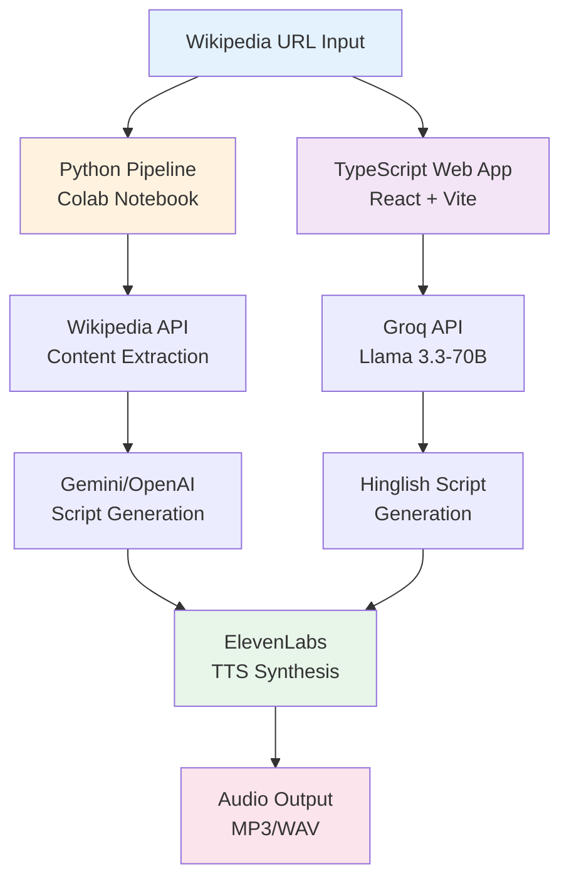
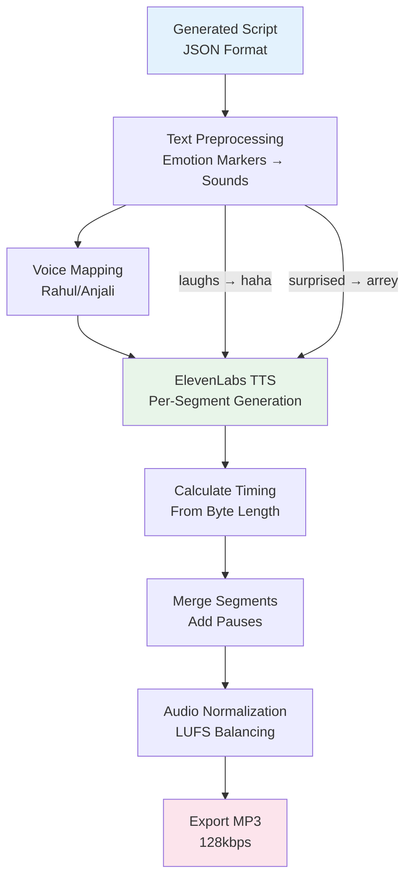

# Vani AI - Technical Design Document

## Project Overview

**Track Selected:** The Synthetic Radio Host

**Project Name:** Vani AI - Hinglish Podcast Generator

Vani AI is a Hinglish podcast generator that transforms Wikipedia articles into natural-sounding two-person conversations. The system combines LLM-based script generation with multi-speaker TTS synthesis to produce engaging audio content. This project was developed for the Winter 30 Hackathon 2026 under "The Synthetic Radio Host" track.

### Key Features

- **Dual Implementation:** Both Python (Colab) and TypeScript (Web App) pipelines
- **Natural Hinglish:** Authentic Hindi-English code-mixing, not literal translations
- **Two-Speaker Format:** Rahul (curious host) and Anjali (expert host) with natural chemistry
- **Premium TTS:** ElevenLabs multilingual_v2 with multi-speaker support
- **Audio Mastering:** Server-side LUFS normalization and compression

---

## System Architecture



---

## Component Overview

### 1. Python Pipeline (`vani_ai_pipeline.ipynb`)

The Python pipeline is designed for Google Colab execution and provides:

| Module | Purpose |
|--------|---------|
| Wikipedia Extraction | Fetches and cleans article content using `wikipedia-api` |
| Script Generation | Generates Hinglish conversation using Gemini or OpenAI |
| TTS Synthesis | Multi-speaker audio using ElevenLabs API |
| Audio Processing | Segment merging and normalization using `pydub` |

**Pipeline Flow:**


### 2. TypeScript Web Application

A React-based frontend providing real-time podcast generation:

| File | Purpose |
|------|---------|
| `App.tsx` | Main application component with state management |
| `services/geminiService.ts` | LLM and TTS API integration |
| `services/db.ts` | IndexedDB for podcast library storage |
| `hooks/useKeyboardShortcuts.ts` | Media player keyboard controls |
| `components/Visualizer.tsx` | Audio visualization effects |
| `components/MovingBorder.tsx` | Animated UI component |

---

## API Integration

### LLM Providers

#### Groq (Primary - Web App)
- **Model**: `llama-3.3-70b-versatile`
- **Purpose**: Fast, cost-effective script generation
- **Configuration**:
  ```typescript
  temperature: 0.95,
  max_tokens: 8192,
  response_format: { type: "json_object" }
  ```

#### Gemini (Python Pipeline)
- **Model**: `gemini-1.5-pro`
- **Purpose**: High-quality script generation
- **Configuration**:
  ```python
  response_mime_type="application/json",
  temperature=0.9,
  top_p=0.95,
  max_output_tokens=4096
  ```

#### OpenAI (Optional Fallback)
- **Model**: `gpt-4-turbo-preview`
- **Purpose**: Alternative when Gemini unavailable

### TTS Provider

#### ElevenLabs
- **Model**: `eleven_multilingual_v2`
- **Output Format**: `mp3_44100_128`
- **Voice Settings**:
  ```typescript
  stability: 0.3,           // Low for emotional variation
  similarity_boost: 0.7,    // Voice consistency
  style: 0.5,               // Expressiveness
  use_speaker_boost: true   // Clearer speech
  ```

**Voice Mapping**:
| Character | Voice ID | Description |
|-----------|----------|-------------|
| Rahul | `IY8nsD2RIP5N4FFQLaT3` | Energetic male, Indian accent |
| Anjali | `4U2MtPm7Mj91nh3AIC1V` | Calm female, Indian accent |

---

## Prompting Strategy

### Hinglish Generation Approach

The system uses a multi-layered prompting strategy to achieve natural Hinglish output:

#### 1. Code-Mixing Authenticity
The prompt explicitly instructs for urban Indian code-mixing (Mumbai/Delhi/Bangalore style), not mere translation:
- "Yaar, yeh toh bohot interesting hai na?"
- "Achcha, matlab basically what happened was..."

#### 2. Conversational Naturalism
Mandatory inclusion of:
- **Fillers**: 'umm', 'uh', 'hmm', 'like'
- **Hinglish tags**: 'na?', 'yaar', 'matlab', 'achcha', 'bilkul'
- **Reactions**: 'Arrey wah!', 'Kya baat hai!', 'Seriously?'

#### 3. Speaker Role Differentiation
| Speaker | Role | Characteristics |
|---------|------|-----------------|
| Rahul | The Curious Listener | Asks questions, reacts emotionally, uses 'yaar', 'bhai' |
| Anjali | The Explainer | Provides context, explains topics, uses 'dekho', 'matlab' |

#### 4. Emotional Dynamics
The prompt mandates:
- Realistic interruptions: "—wait wait, pehle ye bata"
- Emotional markers: (laughs), (surprised), (thinking)
- Incomplete thoughts: "So basically... hmm..."

#### 5. Turn Length Constraints
- Maximum 1-3 sentences per turn
- Each turn = 3-12 seconds when spoken
- Short reactions encouraged: "Haan haan", "Achcha"

---

## Data Models

### TypeScript Types

```typescript
interface ScriptPart {
  speaker: 'Rahul' | 'Anjali';
  text: string;
  cleanedText?: string;  // TTS-processed version
}

interface ConversationData {
  title: string;
  script: ScriptPart[];
  sourceUrl?: string;
}

interface SegmentTiming {
  index: number;
  start: number;   // Start time in seconds
  end: number;     // End time in seconds
  speaker: 'Rahul' | 'Anjali';
}

interface AudioResult {
  audioBase64: string;
  segmentTimings: SegmentTiming[];
  cleanedScript: ScriptPart[];
}

enum AppState {
  IDLE = 'IDLE',
  GENERATING = 'GENERATING',
  PLAYING = 'PLAYING',
  LIBRARY = 'LIBRARY',
  ERROR = 'ERROR'
}
```

### Python Data Classes

```python
@dataclass
class ScriptLine:
    speaker: Literal["Rahul", "Anjali"]
    text: str

@dataclass
class PodcastScript:
    title: str
    script: List[ScriptLine]
    source_url: str
```

---

## Audio Pipeline



### Segment Generation

1. **Text Preprocessing**:
   - Emotion markers converted to spoken equivalents
   - `(laughs)` → "haha"
   - `(surprised)` → "arrey"
   - Parentheticals removed

2. **TTS API Call**:
   - Per-segment generation (one API call per line)
   - Voice ID selected based on speaker
   - Multilingual model for Hindi support

3. **Segment Timing**:
   - Calculated from byte length
   - MP3 at 128kbps = 16,000 bytes/second
   - Scaled to match actual audio duration

### Audio Merging

1. **Intro Silence**: 500ms
2. **Inter-segment Pause**: 250ms
3. **Outro Silence**: 500ms
4. **Normalization**: Audio levels balanced
5. **Export**: MP3 at 128kbps

### Playback Synchronization

The web app synchronizes transcript highlighting with audio playback:

```typescript
const activeLineIndex = useMemo(() => {
  const activeSegment = segmentTimings.find(
    seg => currentTime >= seg.start && currentTime < seg.end
  );
  return activeSegment?.index ?? 0;
}, [currentTime, segmentTimings]);
```

---

## Testing Strategy

### TypeScript Tests (Vitest)

| Test Suite | Coverage |
|------------|----------|
| `geminiService.test.ts` | TTS preprocessing, base64 decoding, emotion markers |
| `useKeyboardShortcuts.test.ts` | Keyboard event handling, media controls |
| `utils.test.ts` | Utility function (cn) |

**Run Tests**:
```bash
npm run test        # Watch mode
npm run test:run    # Single run
npm run test:coverage  # With coverage report
```

### Python Tests (Pytest)

| Test Suite | Coverage |
|------------|----------|
| `test_wikipedia_extraction.py` | URL parsing, content cleaning, validation |
| `test_tts_synthesis.py` | Voice configuration, preprocessing, timing |

**Run Tests**:
```bash
cd tests/python
pip install -r requirements.txt
pytest -v
```

---

## Performance Considerations

### Optimization Strategies

1. **Streaming TTS**: Audio chunks processed as they arrive
2. **Segment Timing Pre-calculation**: Avoid runtime duration detection
3. **IndexedDB Caching**: Previously generated podcasts stored locally
4. **Web Audio API**: Native browser audio processing

### Latency Breakdown

| Stage | Typical Duration |
|-------|------------------|
| Wikipedia fetch | 0.5-1s |
| Script generation | 3-8s |
| TTS synthesis (10 segments) | 10-20s |
| Audio decoding | 0.2-0.5s |
| **Total** | **15-30s** |

---

## Security Considerations

1. **API Keys**: Stored in environment variables, not committed
2. **CORS**: Browser-side API calls use allowed origins
3. **Input Validation**: URL parsing with error handling
4. **Content Sanitization**: Wikipedia text cleaned before LLM processing

---

## Future Enhancements

1. **Real-time Streaming**: Generate audio as script is produced
2. **Custom Voices**: User-uploaded voice cloning
3. **Multi-language Support**: Beyond Hinglish
4. **Podcast Distribution**: RSS feed generation
5. **Analytics**: Listen tracking and engagement metrics

---

## File Structure

```
Vani 4/
├── App.tsx                    # Main React component
├── index.tsx                  # Entry point
├── types.ts                   # TypeScript type definitions
├── vite.config.ts            # Vite + Vitest configuration
├── components/
│   ├── Visualizer.tsx        # Audio visualization
│   └── MovingBorder.tsx      # Animated border effect
├── hooks/
│   └── useKeyboardShortcuts.ts  # Media player controls
├── services/
│   ├── geminiService.ts      # LLM + TTS integration
│   └── db.ts                 # IndexedDB operations
├── lib/
│   └── utils.ts              # Utility functions
├── tests/
│   ├── setup.ts              # Vitest setup
│   ├── services/
│   │   └── geminiService.test.ts
│   ├── hooks/
│   │   └── useKeyboardShortcuts.test.ts
│   ├── lib/
│   │   └── utils.test.ts
│   └── python/
│       ├── requirements.txt
│       ├── conftest.py
│       ├── test_wikipedia_extraction.py
│       └── test_tts_synthesis.py
├── vani_ai_pipeline.ipynb    # Python Colab pipeline
├── TECHNICAL_DESIGN.md       # This document
└── README.md                 # Quick start guide
```

---

## Version History

| Version | Date | Changes |
|---------|------|---------|
| 1.0.0 | Dec 2024 | Initial release with Gemini integration |
| 1.1.0 | Dec 2024 | Added Python pipeline for hackathon compliance |
| 1.2.0 | Dec 2024 | Added comprehensive unit tests |
